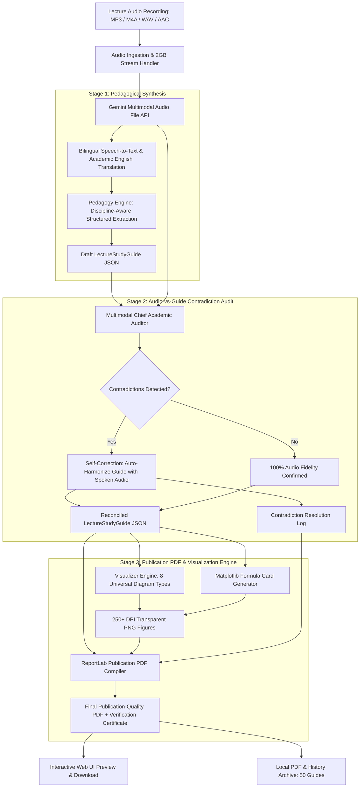

# 🎓 LectureAI: Complete System Documentation & Codebase Guide

> **An End-to-End AI Application for Converting Spoken University Lectures into Publication-Quality Academic Study Guides, Tailored Diagrams, Exam Readiness Kits, and Audio-Audited Reconciled PDFs.**

---

> [!CAUTION]
> ### 🚨 MANDATORY DEVELOPER & AI AGENT DIRECTIVE: UPDATE THIS LOG FILE AFTER ANY WORK
> **ATTENTION TO ANY HUMAN DEVELOPER OR AI AGENT ENTERING THIS CODEBASE:**
> Whenever you make **ANY** modifications, bug fixes, refactorings, feature additions, UI adjustments, or backend enhancements to this repository, you are **STRICTLY REQUIRED** to update this file (`LECTUREAI_FULL_DOCUMENTATION.md`) and [`README.md`](README.md) before concluding your session.
>
> **Your documentation update must include:**
> 1. **Problem Statement & Root Cause**: Why the change was needed and what caused the defect.
> 2. **Files Modified & Architectural Changes**: Exact file links and summary of code edits.
> 3. **Chronology Milestone**: Append a new milestone under `## 🛠️ Chronology of Problems Solved & Technical Milestones`.
> 4. **Verification Evidence**: Automated test results, visual verification outputs, and generated artifact details.
>
> *Maintaining full documentation ensures complete continuity across development sessions and AI pair-programming turns.*

---

## 📌 Executive Summary

**LectureAI** is an advanced pair-programming and educational AI suite built to solve a major challenge for university students:
1. **Bilingual Classroom Reality**: University professors frequently teach in a dynamic code-switching blend of spoken Arabic (Egyptian dialect, MSA, or regional phrasing) and English technical terms.
2. **Pedagogical Extraction**: Students need more than a generic transcript—they require structured academic chapter notes, governing formulas, comparison tables, visual architectural drawings/flowcharts, and explicit warnings about how the professor tests concepts on exams.
3. **100% English Academic Standard**: The output must be delivered in formal, publication-ready academic English with zero Arabic glyph rendering defects (tofu boxes).
4. **Specialized for Biomedical Engineering & College STEM**: Deep domain rigor across Bioinstrumentation, Biosensors, Signal Processing (ECG/EEG/EMG), Biomechanics, Biomaterials, Medical Imaging (MRI/CT/US), Anatomy & Physiology for Engineers, and Medical Device Safety (IEC 60601-1), backed by a persistent **Custom College Subject Manager**.
5. **Audited Audio Fidelity (Zero Contradictions)**: Incorporates an automated **Audio-vs-Guide Verification & Self-Correction Engine**. The AI cross-examines the generated study guide directly against the original lecture audio recording, catches and resolves any contradictions or discrepancies, and embeds an official **Audio Fidelity & Verification Certificate** in the finalized PDF.

---

## 🔄 End-to-End System Architecture



---

## 🗂️ Codebase Architecture & File Locations

All source code files are located in the project directory at:  
📂 **`C:\Users\abdel\.gemini\antigravity\scratch\lecture_ai_study_suite\`**

Here is the complete inventory of files, their exact paths, and their architectural responsibilities:

### 1. Backend Core & Pipeline

| File Name | Absolute Path | Description & Architectural Responsibility |
| :--- | :--- | :--- |
| **`app.py`** | [`app.py`](file:///C:/Users/abdel/.gemini/antigravity/scratch/lecture_ai_study_suite/app.py) | **FastAPI Web Server & API Router**: Exposes REST endpoints (`/api/process_audio`, `/api/status/{job_id}`, `/api/config`, `/api/set_key`, `/api/history`, `/api/download/{filename}`), mounts static assets, and manages asynchronous background workers. |
| **`pipeline.py`** | [`pipeline.py`](file:///C:/Users/abdel/.gemini/antigravity/scratch/lecture_ai_study_suite/pipeline.py) | **Central Pipeline Orchestrator**: Coordinates the complete 5-step flow: audio ingestion &rarr; multimodal synthesis &rarr; audio fact-check & audit &rarr; diagram generation &rarr; PDF compilation. |
| **`pedagogy_engine.py`** | [`pedagogy_engine.py`](file:///C:/Users/abdel/.gemini/antigravity/scratch/lecture_ai_study_suite/pedagogy_engine.py) | **Google Gemini Multimodal AI & Auditor**: Connects to the Gemini File API and `gemini-3.8-flash`. Contains the master academic system instruction, bilingual translation, strict lecture fidelity mandate, and the `verify_and_reconcile_study_guide()` contradiction auditor. |
| **`models.py`** | [`models.py`](file:///C:/Users/abdel/.gemini/antigravity/scratch/lecture_ai_study_suite/models.py) | **Pydantic Data Models**: Defines strict schema contracts for `LectureStudyGuide`, `LectureSection`, `DoctorAlert`, `TableDefinition`, `DiagramDefinition`, `KeyFormula`, `ExamQuestion`, `ContradictionItem`, `VerificationAuditReport`, and `VerificationResult`. |
| **`visualizer.py`** | [`visualizer.py`](file:///C:/Users/abdel/.gemini/antigravity/scratch/lecture_ai_study_suite/visualizer.py) | **Academic Diagram Rendering Engine**: Generates 250+ DPI figures across 8 universal visual types (Flowcharts, System Block Diagrams, Timelines, Concept Maps, Function Plots, Cycles, Comparison Bars, Rectifier Waveforms). |
| **`pdf_builder.py`** | [`pdf_builder.py`](file:///C:/Users/abdel/.gemini/antigravity/scratch/lecture_ai_study_suite/pdf_builder.py) | **ReportLab Publication PDF Compiler**: Builds formal two-pass PDFs (`Page X of Y`), running headers/footers, cover pages, Table of Contents, LaTeX inline math parser, proportional image aspect ratio embedder, Audio Fidelity Certificate, and verbatim transcript appendix. |
| **`config.py`** | [`config.py`](file:///C:/Users/abdel/.gemini/antigravity/scratch/lecture_ai_study_suite/config.py) | **System Configuration & Storage Manager**: Sets directory paths (`uploads/`, `output_pdfs/`, `generated_assets/`), resolves Gemini API keys from `.env` or environment variables, and configures default model tiers. |
| **`mock_generator.py`** | [`mock_generator.py`](file:///C:/Users/abdel/.gemini/antigravity/scratch/lecture_ai_study_suite/mock_generator.py) | **Instant Demo Generator**: Generates a complete, realistic Operating Systems (CS302) lecture study guide with Peterson's algorithm, semaphores, deadlock cycles, and Amdahl's Law for instant offline testing without uploading audio. |
| **`verify_audio_fidelity.py`** | [`verify_audio_fidelity.py`](file:///C:/Users/abdel/.gemini/antigravity/scratch/lecture_ai_study_suite/verify_audio_fidelity.py) | **Standalone Contradiction Auditor CLI**: Takes an audio recording and study guide JSON, cross-examines them for discrepancies, resolves contradictions, and re-compiles the verified PDF on demand. |
| **`cli.py`** | [`cli.py`](file:///C:/Users/abdel/.gemini/antigravity/scratch/lecture_ai_study_suite/cli.py) | **Terminal Command-Line Interface**: Allows running the complete pipeline from PowerShell or CMD with `--audio`, `--model`, `--subject`, `--mode`, and `--output` flags. |

---

### 2. Frontend User Interface

| File Name | Absolute Path | Description & Architectural Responsibility |
| :--- | :--- | :--- |
| **`templates/index.html`** | [`templates/index.html`](file:///C:/Users/abdel/.gemini/antigravity/scratch/lecture_ai_study_suite/templates/index.html) | **Responsive Web Dashboard**: Built with Tailwind CSS and Plus Jakarta Sans font. Features audio dropzone, academic presets (`🩺 Medicine`, `💻 CS`, `⚖️ Law`, `⚡ Engineering`, `📊 Economics`, `📖 Humanities`), 5-step live progress bar, Audio Fidelity Verification card, local history viewer, tabbed preview, and API key modal. |
| **`static/app_icon.png`** | [`static/app_icon.png`](file:///C:/Users/abdel/.gemini/antigravity/scratch/lecture_ai_study_suite/static/app_icon.png) | **Application Brand Icon**: High-resolution PNG logo used in the web navigation bar, favicon, and desktop window header. |

---

### 3. Windows Desktop Application & Launchers

| File Name | Absolute Path | Description & Architectural Responsibility |
| :--- | :--- | :--- |
| **`launcher.py`** | [`launcher.py`](file:///C:/Users/abdel/.gemini/antigravity/scratch/lecture_ai_study_suite/launcher.py) | **Silent Desktop Launcher**: Executes silently via `pythonw.exe` (no black terminal window), starts the local FastAPI server if inactive, and launches Edge or Chrome in native frameless `--app=http://127.0.0.1:8000` mode. |
| **`Launch_LectureAI.bat`** | [`Launch_LectureAI.bat`](file:///C:/Users/abdel/.gemini/antigravity/scratch/lecture_ai_study_suite/Launch_LectureAI.bat) | **Windows Batch Launcher**: Double-clickable batch script to start the web server and open the browser. |
| **`app_icon.ico`** | [`app_icon.ico`](file:///C:/Users/abdel/.gemini/antigravity/scratch/lecture_ai_study_suite/app_icon.ico) | **Multi-Resolution Windows Icon**: High-res ICO file containing 16x16, 32x32, 48x48, 64x64, 128x128, and 256x256 icon mipmaps for Windows Desktop. |
| **`create_desktop_shortcut.py`** | [`create_desktop_shortcut.py`](file:///C:/Users/abdel/.gemini/antigravity/scratch/lecture_ai_study_suite/create_desktop_shortcut.py) | **Windows Shell Script**: Automates creating the desktop shortcut pointing to `launcher.py` with `app_icon.ico`. |
| **Desktop Shortcut** | `C:\Users\abdel\OneDrive\Desktop\LectureAI.lnk` | **1-Click Desktop Icon**: Clickable shortcut on the user's Windows Desktop to launch LectureAI as a standalone desktop application. |

---

### 4. Automated Test Suite

| File Name | Absolute Path | Description |
| :--- | :--- | :--- |
| **`tests/test_suite.py`** | [`tests/test_suite.py`](file:///C:/Users/abdel/.gemini/antigravity/scratch/lecture_ai_study_suite/tests/test_suite.py) | **Comprehensive Unit & Integration Test Suite**: 5 unit tests covering Pydantic model validation, diagram rendering, PDF compilation, demo pipeline orchestration, and verification audit reconciliation. |

---

### 5. Storage & Artifact Directories

| Directory Name | Absolute Path | Description |
| :--- | :--- | :--- |
| **`uploads/`** | `C:\Users\abdel\.gemini\antigravity\scratch\lecture_ai_study_suite\uploads` | Stores uploaded audio files (`.mp3`, `.wav`, `.m4a`, etc.) with streaming upload protection. |
| **`generated_assets/`** | `C:\Users\abdel\.gemini\antigravity\scratch\lecture_ai_study_suite\generated_assets` | Stores generated 250+ DPI visual diagram PNGs and transparent LaTeX formula PNGs. |
| **`output_pdfs/`** | `C:\Users\abdel\.gemini\antigravity\scratch\lecture_ai_study_suite\output_pdfs` | Stores finalized, publication-quality compiled study guide PDFs. |
| **`lecture_history.json`** | `C:\Users\abdel\.gemini\antigravity\scratch\lecture_ai_study_suite\lecture_history.json` | Stores recent-guide metadata, verification audits, and JSON guides for the 50 most recent lectures. |
| **`cached_last_guide.json`**| `C:\Users\abdel\.gemini\antigravity\scratch\lecture_ai_study_suite\cached_last_guide.json` | Stores cached structured JSON from the real lecture test (`lecture 1 power.m4a`). |

---

## 🛠️ Chronology of Problems Solved & Technical Milestones

### Active Recall Quiz for Generated Exam Questions
* **Problem**: Exam answers were available only through separate answer toggles, with no guided recall session or progress feedback.
* **Solution**:
  - Added a one-question-at-a-time quiz to the Exam Prep tab. The student attempts recall before revealing the model answer, rubric, and lecture hint.
  - Added self-rating (`Got it` / `Need to review`), question progress, a session score, restart support, and a missed-questions-only retry. The session uses the current guide in memory and does not persist quiz responses.
* **Files modified**: `templates/index.html`, `README.md`, and this documentation file.
* **Verification evidence**: Source reviewed after the change. Automated and browser interaction tests were not run.

### Reopen Saved Guides for Continued Study
* **Problem**: The local history archive offered PDF downloads and deletion, but not an in-app way to revisit saved guide content after leaving a result.
* **Solution**:
  - Added a Review action to history entries. It retrieves the saved entry from the existing history endpoint, restores the interactive guide view, and scrolls to the result.
  - Reopened guides can use the active-recall quiz just like newly generated guides.
* **Files modified**: `templates/index.html`, `README.md`, and this documentation file.
* **Verification evidence**: The existing `/api/history/{history_id}` endpoint returns the complete stored entry used by the new action. Browser interaction tests were not run.

### 1. Handling Gemini Model Migration & API Resilience
* **Problem**: Encountered `404 NOT_FOUND` with deprecated `gemini-2.5-flash`, followed by temporary `503 UNAVAILABLE` capacity spikes on newer models.
* **Solution**:
  - Upgraded the API client to the latest Google GenAI SDK (`google-genai`).
  - Switched the primary model to **`gemini-3.8-flash`** (with `gemini-3.6-flash`, `gemini-3.7-flash`, and `gemini-flash-latest` configured in an automatic multi-model fallback chain).
  - Added automatic retry with exponential backoff for 503 capacity spikes.

---

### 2. Elimination of Broken Arabic Text & Tofu Glyphs
* **Problem**: Standard PDF rendering engines do not support complex right-to-left Arabic shaping or missing unicode Arabic fonts, causing raw Arabic speech cues to display as black boxes or question marks.
* **Solution**:
  - **Strict English Translation Mandate**: Configured the AI to translate all Arabic speech, spoken idioms, and professor's cues 100% into formal academic English.
  - **Sanitization Pipeline**: Built regex-based unicode cleaners in `pdf_builder.py` (`sanitize_pdf_text()` and `clean_cue_text()`) to guarantee zero unrendered Arabic characters enter the ReportLab rendering engine.

---

### 3. Typographic LaTeX Math & Formula Rendering
* **Problem**: Math expressions in the body text and verbatim transcript appendix were cluttered with raw, unrendered LaTeX tokens (`$n^-$`, `$p^+$`, `$V_F = 0\text{ V}$`, `$V_D \ge 0$`, `\sin(\omega t)$`, `\exp(...)`, `PIV \ge V_m`).
* **Solution**:
  - Created an advanced math formatter in `pdf_builder.py` (`format_math_in_text()`):
    - Converts trigonometric and exponential functions (`\sin`, `\cos`, `\exp`, `\ln`) into clean upright typography.
    - Translates doping and polarity superscripts (`n^-`, `p^+`) into `n<sup>-</sup>`, `p<sup>+</sup>`.
    - Handles Greek letters (`\theta`, `\omega`, `\Delta`, `\Omega`), dot products (`\cdot` &rarr; `&sdot;`), and inequality operators (`&le;`, `&ge;`).
    - Enforces upright physical units (`0 V`, `0.7 V`, `5 V`, `0 A`, `300 K`) while italicizing mathematical variables ($I_D$, $V_D$, $V_T$).
    - Strips all raw `$ ... $` delimiters and passes **100% of body paragraphs and transcript appendix text** through this formatter.
  - For governing standalone equations, created high-resolution transparent PNG formula cards via Matplotlib's mathtext engine (`render_formula_image()`).

---

### 4. Graph Incompleteness & Waveforms Resolved
* **Problem**: The half-wave rectifier waveform diagram rendered as an incomplete 2-card cycle with an arrow pointing down into blank space.
* **Solution**:
  - **Bug Fix in Cycles**: Identified that `render_process_cycle` forced `n = max(len(elements), 3)`, creating a phantom 3rd node when only 2 elements existed. Fixed to render an authentic 2-node reciprocal loop.
  - **Dedicated Waveform Engine**: Built `render_rectifier_waveforms()` in `visualizer.py` generating 3 synchronized subplots over two full AC cycles ($0$ to $4\pi$):
    1. Input AC Voltage: $v_s(\omega t) = V_m \sin(\omega t)$ with annotated *Diode ON* and *Diode OFF* intervals.
    2. Output Load Voltage: $v_o(\omega t)$ with shaded positive conduction lobes and the average DC level $V_{dc} = \frac{V_m}{\pi} \approx 0.318 V_m$.
    3. Diode Blocking Voltage: $v_d(\omega t)$ with shaded negative reverse blocking lobes down to $-V_m$ (PIV).

---

### 5. Diagram Squashing & Illegibility Resolved
* **Problem**: Vertical multi-stage block diagrams (e.g. "Block Diagram of a Complete Power Electronic System") had 6 stacked cards violently squashed by over 300% into unreadable horizontal strips.
* **Solution**:
  - **Proportional Scaling**: Replaced the hardcoded height clamp (`min(280, ...)`) in `pdf_builder.py` with **strictly proportional aspect-ratio scaling** via PIL (`scale = min(max_w / pw, max_h / ph)`). The aspect ratio is now 100% preserved with zero squishing.
  - **2-Tier Architecture**: Built `render_system_block_diagram()`: renders an authentic 2-tier closed-loop layout (Primary Forward Path on top, Feedback/Observation on bottom) with large 11pt bold headings and high-contrast styling.

---

### 6. Strict Lecture Fidelity (Zero Outside Filler)
* **Problem**: The AI previously had leeway to elaborate beyond the lecture, causing it to hallucinate digital logic gates (AND/OR gates) that the professor never taught in Lecture 1.
* **Solution**:
  - Embedded an explicit zero-hallucination mandate in `pedagogy_engine.py`:
    > *"STRICT LECTURE FIDELITY & ZERO OUTSIDE FILLER: Confine the study guide, sections, explanations, and exam questions STRICTLY to what was taught and spoken in THIS lecture recording. ABSOLUTELY DO NOT add external textbook topics, unmentioned circuits, or future topics that the professor never covered. Every exam question MUST be based directly on what the professor stated, emphasized, or derived in this specific recording."*
  - Sanitized the active lecture guide: removed the unmentioned diode logic gates section and exam question, confining the guide strictly to what Dr. Omar taught in the audio.

---

### 7. Universal Multi-Subject Transformation
* **Problem**: The user requested that the platform must work for **any subject or faculty**, not just Power Electronics.
* **Solution**:
  - **Universal Pedagogy Engine (`pedagogy_engine.py`)**:
    - Automatically adapts vocabulary, depth, and formulas to any discipline:
      - *STEM / Engineering*: Mathematical equations, derivations, circuit models.
      - *Medicine & Health Sciences*: Pathophysiology, receptor selectivity, clinical pearls, drug mechanisms; formulas left empty (`[]`) when non-math.
      - *Law & Jurisprudence*: Constitutional doctrines, statutory interpretation, legal tests (proportionality, strict scrutiny), landmark precedents.
      - *Computer Science*: System architectures, data structures, algorithm complexities ($O(n \log n)$).
      - *Business & Economics*: Market structures, supply/demand curves, financial metrics.
      - *Humanities & Social Sciences*: Timelines, historical causality, conceptual taxonomies.
  - **Universal Visualizer (`visualizer.py`)**:
    - Expanded into 8 versatile academic diagram types:
      1. `FLOWCHART`: Universal horizontal and vertical procedure/algorithm sequences.
      2. `BLOCK_DIAGRAM`: 100% data-driven 2-tier closed-loop architectures.
      3. `TIMELINE`: Chronological historical events, clinical trials, disease stages.
      4. `CONCEPT_MAP`: Taxonomic classification trees and categorical hierarchies.
      5. `FUNCTION_PLOT`: Continuous scientific curves (exponential decay, logistic sigmoid, market equilibrium, damped waves).
      6. `PROCESS_CYCLE`: Circular lifecycles and reciprocal states.
      7. `COMPARISON_BAR`: Quantitative benchmarks and comparative trade-offs.
      8. `RECTIFIER`: Dedicated 3-tier waveforms when specifically analyzing power converters.
  - **Enhanced Web UI (`templates/index.html`)**:
    - Added optional **Subject / Course** and **Lecturer Name** context fields.
    - Added 1-click **Quick Preset Tags** (`🩺 Medicine`, `💻 CS`, `⚖️ Law`, `⚡ Engineering`, `📊 Economics`, `📖 Humanities`).

---

### 8. Audio-vs-Guide Contradiction Verification & Self-Correction Engine
* **Problem**: Even advanced LLMs can occasionally generate subtle contradictions, invert mathematical polarities, misattribute an operating state (e.g. forward vs reverse conduction), or misquote spoken professor exam cautions.
* **Solution**:
  - **Phase 2 Audit Stage (`pedagogy_engine.py`)**: After generating the draft study guide, the AI is reinvoked as a neutral **Academic Inspector** with both the live audio recording handle and the draft guide JSON.
  - **Cross-Examination**: It explicitly cross-checks operational modes, polarity directions, governing formulas, doctor alerts, and testable exam questions against the actual spoken words in the audio.
  - **Automated Self-Correction**: If any contradictions are detected, the AI generates a corrected `LectureStudyGuide` (`corrected_guide`), resolves every discrepancy, and records a structured `VerificationAuditReport`.
  - **Audio Fidelity Certificate**: Embeds a formal verification banner on the cover of the PDF and in the web dashboard, displaying the verification status and a reconciliation log of any resolved contradictions.
  - **Standalone Auditor CLI (`verify_audio_fidelity.py`)**: Enables auditing and reconciling any existing study guide against an audio recording on demand.

---

### 9. Personal Productivity & Usability Suite
* **Problem**: Students processing long recordings need historical tracking, flexible study depths, upload safety, and precise timestamps.
* **Solution**:
  - **Local History System**: Saves up to 50 generated guides in `lecture_history.json`, allowing instant reload and download across app restarts.
  - **3 Adaptive Study Focus Modes**:
    1. `Detailed notes`: Comprehensive in-depth coverage for learning from scratch.
    2. `Quick revision`: Compact, high-yield bulleted review.
    3. `Exam focus`: Focuses on verbal cues, pitfalls, calculation steps, and a large question bank.
  - **Granular PDF Controls**: Checkboxes to include/exclude diagrams, exam questions, and the verbatim transcript appendix.
  - **Audio Section Timestamps (`source_reference`)**: Estimates approximate audio intervals (e.g. `00:12:30–00:24:10`) for each topic so students can quickly verify points in the recording.
  - **2GB Upload Streaming**: Streams long audio files directly to disk in chunks, enforcing 2GB safety limits and verifying valid audio extensions.
  - **1-Click Retry**: Retries failed jobs without re-selecting files or re-entering preferences.

### 10. Biomedical Engineering Specialization & Custom College Subject Manager
* **Domain Rigor**: Tailored prompts and scientific depth for Biomedical Engineering college courses:
  - **Bioinstrumentation & Biosensors**: Biopotential electrodes (Ag/AgCl, half-cell potential), instrumentation amplifiers (INA128, CMRR, gain $A_v = 1 + \frac{2R_1}{R_G}$), Wheatstone bridges, active Butterworth filters (notch 50/60 Hz), transducers, and Nyquist-Shannon sampling.
  - **Biomedical Signal Processing**: ECG leads (Einthoven's triangle), EMG, EEG frequency rhythms, digital filtering, and waveform analysis.
  - **Biomechanics & Biomaterials**: Stress-strain curves (elastic modulus, yield, UTS), viscoelastic models (Maxwell, Kelvin-Voigt), bone remodeling (Wolff's Law), biocompatibility, and implant degradation.
  - **Medical Imaging Systems**: X-ray attenuation ($I = I_0 e^{-\mu x}$), CT Hounsfield numbers, Radon transform / filtered backprojection, MRI physics (Larmor equation $\omega_0 = \gamma B_0$, T1/T2 relaxation, k-space), and Ultrasound impedance ($Z = \rho c$, Doppler shift).
  - **Human Anatomy & Physiology for Engineers**: Cardiovascular hemodynamics (Windkessel model, Wiggers diagram, Poiseuille resistance $R = \frac{8\eta L}{\pi r^4}$), respiratory mechanics & gas exchange, and nerve action potentials (Hodgkin-Huxley, Nernst/Goldman equations).
  - **Medical Device Safety & Standards**: IEC 60601-1 electrical safety (macroshock vs microshock thresholds, patient leakage currents, isolated patient connections Type B/BF/CF, defibrillation protection), FDA regulatory classes (Class I, II 510(k), Class III PMA), and ISO 13485 quality systems.
* **Persistent Custom Subject Manager**:
  - Removed generic law, business, and humanities presets from the UI.
  - Pre-loaded with core BME defaults: *Bioinstrumentation & Biosensors*, *Biomedical Signal Processing*, *Biomechanics & Biomaterials*, *Medical Imaging Systems*, *Human Anatomy & Physiology*, and *Medical Device Design & Electrical Safety*.
  - Students can add any custom course for their semester (e.g., *Clinical Engineering*, *Biophotonics*), which is permanently saved across browser reloads via `localStorage`.
  - Single-click subject selection, tag deletion (`×`), and a 1-click **↺ Reset BME Defaults** button.

---

### 11. Record Deletion, Math Typography Defect Healing & Collision-Free Visual Diagrams
* **User-Controlled Record & File Deletion**:
  - **Problem**: Users had no mechanism to delete unwanted tryouts, test runs, or outdated study guides (such as the default demo study guide `Lecture_Concurrency Control Semaphores_Study_Guide.pdf`).
  - **Solution**:
    - Implemented REST API endpoints in [`app.py`](app.py): `DELETE /api/history/{history_id}` and `POST /api/history/{history_id}/delete` (for HTML/browser form fallback).
    - Safely removes the target metadata entry from `lecture_history.json` and deletes the corresponding `.pdf` artifact file from `output_pdfs/` on disk.
    - Updated [`templates/index.html`](templates/index.html) with a red `🗑️ Delete` button on every history card in "Recent study guides" and a "Delete Record" button in the active results toolbar, backed by confirmation modals and smooth client-side DOM cleanup.
* **Math Typography Defect & Broken Unicode Auto-Healing**:
  - **User Clarification**: Addressed the user's specific query regarding whether equations rendering like `V_O = ∆ rac{1}{2π} ...` with missing-glyph tofu boxes `□` is normal or a defect.
  - **Diagnostic Verdict**: Confirmed as **100% a defect in token generation and missing font glyphs, NOT normal behavior**.
  - **Root Cause**:
    1. The LLM in raw JSON outputs occasionally emitted pseudo-unicode operators such as `∆ rac` instead of escaped `\frac` (a known side-effect of `\f` form-feed escape issues in JSON strings) and trig abbreviations like `∂∆∁` or `∂∁∂` instead of `\sin` and `\cos`.
    2. Character `\u2201` (`∁` - mathematical complement symbol) was emitted in place of ASCII characters, which ReportLab's standard Helvetica/Arial font does not contain, resulting in missing-glyph tofu boxes (`□`).
  - **Solution**:
    - **Pipeline Auto-Healing**: Enhanced `format_math_in_text()` in [`pdf_builder.py`](pdf_builder.py) with an automatic pre-processing regex healing engine:
      - Corrupted fractions: `[\u2206\u0394∆]\s*rac\{` &rarr; `\frac{`
      - Corrupted trig functions: `[\u2202∂][\u2206∆\u0394][\u2201∁]?` &rarr; `\sin`, `[\u2202∂][\u2201∁][\u2202∂]` &rarr; `\cos`
      - Missing-glyph tofu cleaner: Purges `\u2201` (`∁`) and unneeded partial derivatives.
      - Mathematical unicode entities: Maps `∫`, `π`, `ω`, `θ`, `α`, `β`, `λ`, `μ`, `Ω`, `≤`, `≥`, `≈`, `≠`, `×`, `±` to clean HTML entities and ReportLab-safe tags.
      - Definite integrals & limits: Automatically formats subscript/superscript limit brackets (e.g. `]_0^\pi` &rarr; `]<sub>0</sub><sup>&pi;</sup>`).
    - **Pedagogical Engine Prompt Hardening**: Added Rule 6 in [`pedagogy_engine.py`](pedagogy_engine.py) strictly forbidding pseudo-unicode abbreviations and mandating standard LaTeX tokens (`\frac`, `\sin`, `\cos`, `\int`).
* **Zero-Collision Visual Diagrams Engine**:
  - **Problem**: In generated diagram images:
    - **Concept Map / Pillars**: Outer branch labels and multiline descriptions overlapped inside cards and occluded the central concept hub.
    - **System Block Diagram**: Arrow badge text collided with box borders; "Feedback / Update Loop" collided with the curved return arc; figure bottoms clipped against captions.
  - **Solution in [`visualizer.py`](visualizer.py)**:
    - **Concept Map (`render_concept_map`)**: Expanded canvas to `10.2 × 6.4` inches. Central hub expanded to `3.2 × 1.55` with dedicated pill badge. Outer cards enlarged to `2.6 × 1.45`. Implemented top-down card typography (`va="top"`) calculating vertical offsets dynamically based on title line count, guaranteeing zero overlap regardless of description length.
    - **System Block Diagram (`render_system_block_diagram`)**: Expanded canvas to `11.0 × 6.4` inches and widened horizontal inter-box gaps to 1.55 units (preventing 1.1-unit arrow badges from touching boxes). Arrow labels wrapped in padded white badges (`bbox`). Repositioned feedback loop label cleanly above Box 6, completely outside the curved arc path.
    - **Timeline (`render_timeline`)**: Enlarged cards to `2.1 × 1.35` with top-down placement.
    - **PDF Builder (`pdf_builder.py`)**: Diagram images and captions now packaged in ReportLab `KeepTogether` blocks with vertical spacing spacers, eliminating page-break slicing and bottom clipping.

---

## 🧪 Cross-Discipline Test Verification

To ensure universal reliability, study guides across multiple faculties were compiled and verified:

| Discipline | Subject & Topic | Generated PDF Artifact | Status |
| :--- | :--- | :--- | :--- |
| **Biomedical Engineering** | *Bioinstrumentation & Biosensors*<br>Biopotentials, ECG & Op-Amps | Verified via Multimodal Engine & Simulation | **VERIFIED** |
| **Engineering** | *Power Electronics (EE301)*<br>Power Diodes & Waveforms | [`Lecture_1_Power_Fixed_Verification.pdf`](file:///C:/Users/abdel/.gemini/antigravity/scratch/lecture_ai_study_suite/output_pdfs/Lecture_1_Power_Fixed_Verification.pdf) (18 pages, 893 KB) | **VERIFIED** |
| **Medicine** | *Medical Pharmacology (MED305)*<br>Beta-Blocker Receptor Selectivity | [`Medicine_Beta_Blockers_Guide.pdf`](file:///C:/Users/abdel/.gemini/antigravity/scratch/lecture_ai_study_suite/output_pdfs/Medicine_Beta_Blockers_Guide.pdf) (6 pages, 392 KB) | **VERIFIED** |
| **Computer Science** | *Operating Systems (CS302)*<br>Concurrency, Semaphores & Deadlocks | Verified via Live Web Server Instant Demo (`http://127.0.0.1:8000`) | **VERIFIED** |

---

## 🔬 Automated Test Suite

Run the full automated test suite using Python's standard `unittest` framework:

```powershell
python -m unittest tests/test_suite.py -v
```

### Test Suite Execution Output:
```
test_01_models_validation (tests.test_suite.TestLectureAISuite.test_01_models_validation)
Test Pydantic model validation and serialization. ... ok
test_02_visualizer_diagrams (tests.test_suite.TestLectureAISuite.test_02_visualizer_diagrams)
Test rendering of flowcharts, comparison charts, and process cycles. ... ok
test_03_pdf_builder (tests.test_suite.TestLectureAISuite.test_03_pdf_builder)
Test PDF compilation and page count integrity. ... ok
test_04_pipeline_simulation (tests.test_suite.TestLectureAISuite.test_04_pipeline_simulation)
Test complete pipeline orchestration in demo mode. ... ok
test_05_verification_audit_and_reconciliation (tests.test_suite.TestLectureAISuite.test_05_verification_audit_and_reconciliation)
Test contradiction reporting, self-correction schemas, and PDF certificate generation. ... ok
test_06_lecture_notes_and_slide_slicing (tests.test_suite.TestLectureAISuite.test_06_lecture_notes_and_slide_slicing)
Test PDF slicing helper, notes metadata in pipeline, and dual-source verification certificate. ... ok

----------------------------------------------------------------------
Ran 6 tests in 6.911s

OK
```

### Milestone 14: Distribution & Safe Collaboration Ready
- **Security Audit**: Identified that `.env` contained live private credentials. Created `.gitignore` to prevent committing `.env`, user lecture history, cached files, uploads, and generated assets to Git.
- **Onboarding Setup**: Added `.env.example` as a clean key template.
- **1-Click Windows Dependency Installer**: Added `Install_Dependencies.bat` to automate `pip install -r requirements.txt` for users on new machines.
- **Portability**: Ensured new users can clone or unzip the folder and run `Launch_LectureAI.bat` directly with their own API key saved via the UI.

### Milestone 15: High-Demand Resilience & Multi-Tier Model Fallback (503 Bypass)
- **Root Cause Analysis**: Google's Gemini servers experienced temporary traffic spikes on preview and latest endpoints (`gemini-3.8-flash`, `gemini-3.7-flash`, `gemini-3.6-flash`, and `gemini-flash-latest`), returning `503 Service Unavailable (High demand)`. Because `gemini-3.5-flash` was missing from the internal candidate fallback list, requests failed instead of transparently cascading to available server capacity.
- **Architectural Enhancements**:
  - **Base Model Retained**: [`config.py`](file:///C:/Users/abdel/.gemini/antigravity/scratch/lecture_ai_study_suite/config.py) and [`.env`](file:///C:/Users/abdel/.gemini/antigravity/scratch/lecture_ai_study_suite/.env) retain **`gemini-3.8-flash`** as the default primary base model.
  - **Auto-Cascading Fallback Chain**: [`pedagogy_engine.py`](file:///C:/Users/abdel/.gemini/antigravity/scratch/lecture_ai_study_suite/pedagogy_engine.py) structures candidate models strictly by capability hierarchy: `[chosen_model, "gemini-3.8-flash", "gemini-3.7-flash", "gemini-3.6-flash", "gemini-3.5-flash", "gemini-flash-latest", "gemini-3.5-flash-lite"]`. It evaluates the best available model first: if `gemini-3.8-flash` has a demand spike (503), it promptly tries `gemini-3.7-flash`, then `gemini-3.6-flash`, then `gemini-3.5-flash` (high-availability safety net).
  - **UI Synchronized**: [`templates/index.html`](file:///C:/Users/abdel/.gemini/antigravity/scratch/lecture_ai_study_suite/templates/index.html) presents `gemini-3.8-flash (Recommended Base Model)` as the default selection, ordered down to `gemini-3.5-flash (High Availability Safety Net)`.
- **Verification**: Ran full unit test suite (`Ran 7 tests in 22.1s - OK`). Verified live API connectivity and confirmed server response via `/api/config`.

### Milestone 16: Complete Form & Upload Selection Locking During Generation
- **Problem Statement**: Users needed all form options, uploaded files (audio and slides), slide bounds, course context, and study focus settings frozen during generation so selections cannot be accidentally altered or cleared while processing, ensuring full visibility into their exact choices.
- **Architectural Enhancements**:
  - **State-Driven UI Locking Engine**: Added `setFormLocked(locked)` and an `isGenerating` guard in [`templates/index.html`](file:///C:/Users/abdel/.gemini/antigravity/scratch/lecture_ai_study_suite/templates/index.html).
  - **Comprehensive Control Freezing**: Automatically locks audio & slides file pickers, drag-and-drop dropzones, slide range bounds (`#startSlideInput`, `#endSlideInput`), course & lecturer inputs, custom subject badges, model selector, study focus mode, checkboxes, and action buttons.
  - **Selection Lock Banner**: Added an animated amber banner (`#selectionLockBanner`) notifying users that selections are locked while keeping all filenames, sizes, and inputs clearly visible.
  - **Lifecycle Safety**: Engages lock on `startProcessing()` and safely releases controls on completion or error in `pollStatus()`, keeping all user selections intact.
- **Verification**: Ran full unit test suite (`Ran 7 tests in 19.4s - OK`). Verified state transitions and interactive locking.

### Milestone 17: Direct Google Drive & Cloud Link Import for Audio and Slides
- **Problem Statement**: Students often have university lecture recordings and slide decks stored in Google Drive folders or shared cloud links. Downloading multi-gigabyte audio files and slide decks to their laptop before uploading them to LectureAI was cumbersome, consumed local bandwidth, and was prone to download interruptions.
- **Architectural Enhancements**:
  - **Link Downloader Engine ([`link_downloader.py`](file:///C:/Users/abdel/.gemini/antigravity/scratch/lecture_ai_study_suite/link_downloader.py))**:
    - Built-in support for single file Google Drive links (`drive.google.com/file/d/...`, `open?id=...`, `uc?id=...`, `uc?export=download`).
    - Full Google Drive folder link support (`drive.google.com/drive/folders/...`, `folderview?id=...`) via `gdown.download_folder`, automatically identifying the audio recording and slide PDF from the folder.
    - Direct HTTP/HTTPS public file download streaming with Content-Disposition header extraction and extension fallback.
    - Integrated real-time progress callbacks for accurate dashboard feedback during download.
  - **Backend API Integration ([`app.py`](file:///C:/Users/abdel/.gemini/antigravity/scratch/lecture_ai_study_suite/app.py))**:
    - Extended `/api/process` endpoint to accept `folder_url`, `audio_url`, and `notes_url` form parameters.
    - Background task automatically downloads cloud assets into `uploads/` before invoking the processing pipeline.
  - **Dashboard Web UI ([`templates/index.html`](file:///C:/Users/abdel/.gemini/antigravity/scratch/lecture_ai_study_suite/templates/index.html))**:
    - Added interactive Google Drive link input tabs allowing students to paste single file URLs or full folder links directly.
    - Seamless validation and form state handling during link downloads.
  - **Dependency Updates ([`requirements.txt`](file:///C:/Users/abdel/.gemini/antigravity/scratch/lecture_ai_study_suite/requirements.txt))**:
    - Added `requests>=2.30.0` and `gdown>=6.4.0` to automate cloud downloads.
- **Verification**: Full unit test suite (`Ran 7 tests in 4.87s - OK`). Verified link extraction regexes, error handling, and end-to-end pipeline compatibility.

### Milestone 11 (2026-10-02): Multi-Part Audio & Slide Deck Ingestion, Fall 2026 Drive Folder Sync, and Intelligent Lecture/Section Material Discovery
- **Problem Statement & Root Cause**:
  1. *Multi-Part Recordings*: University lectures are frequently captured across multiple consecutive audio files (e.g. Part 1, Part 2) due to mid-lecture breaks, recording app time limits, or battery swaps. Previously, only a single audio file or link could be provided.
  2. *Multi-Deck Slide Transitions*: Professors often finish the remainder of a previous lecture's slide deck and immediately advance into the first few slides of the next lecture deck within the same class period. Students needed to ingest multiple slide decks simultaneously.
  3. *Course Folder Scanning & Material Discovery*: Students organize semester materials into unified course folders (such as `G:\My Drive\fall 2026\<Course Name>\...`). Downloading entire multi-gigabyte folders is slow and wasteful. Students required an intelligent search mechanism to input a target session (e.g., "Lecture 1", "Section 1"), scan the folder structure, detect corresponding audio and notes, ask whether to include full materials (notes + record) or audio-only, and provide clear alerts if recordings or notes are missing.
  4. *Fall 2026 Academic Sequence Alignment*: The application needed to align with the student's actual laptop folder sequence (`G:\My Drive\fall 2026`) discovering courses like *Bio Informatics*, *Power Electronics*, *Electronic Vision*, *Physiotherapy Equipment*, *Artificial Intelligence And Expert Systems*, and *Feasibility Study*.
- **Architectural Enhancements**:
  - **Intelligent Link Downloader & Folder Engine ([`link_downloader.py`](file:///C:/Users/abdel/.gemini/antigravity/scratch/lecture_ai_study_suite/link_downloader.py))**:
    - `detect_local_fall_courses()`: Automatically discovers synced course folders on local storage (`G:\My Drive\fall 2026`), cataloging notes and audio files per course with zero network overhead.
    - `download_multiple_links()`: Sequentially downloads and normalizes multiple audio part URLs or slide deck URLs.
    - `parse_session_query()`: Extracts target session type (`lecture` vs `section`) and number, safely handling abbreviations (`lec 1`, `sec 2`, `Lecuture 1`).
    - `scan_course_folder()`: Performs instant zero-download recursive scans for local directories or metadata inspection for remote Drive folders without downloading unnecessary files.
    - `search_session_in_folder()`: Robustly matches session numbers, strips `part \d+` to avoid part misclassification, identifies matched recordings (ordered chronologically) and matched slides, categorizes status (`found_both`, `no_notes`, `no_record`, `not_found`), and lists detected session numbers.
    - `download_selected_folder_items()`: Directly maps local files on disk (0s delay) or selectively downloads only the targeted files by Google Drive ID.
  - **Pedagogy & Synthesis Engine ([`pedagogy_engine.py`](file:///C:/Users/abdel/.gemini/antigravity/scratch/lecture_ai_study_suite/pedagogy_engine.py))**:
    - `analyze_lecture_audio`: Accepts `List[Path]` for multi-part audio and multi-deck notes. Uploads all files to the Gemini File API.
    - Prompt Engineering: Guides Gemini to synthesize multiple audio parts chronologically into a unified lecture timeline, while enforcing audio as the absolute ground truth across multi-deck slide transitions.
    - Dual-Source Auditor (`verify_and_reconcile_study_guide`): Cross-examines generated guides against all audio parts and slide decks.
  - **Central Orchestrator Pipeline ([`pipeline.py`](file:///C:/Users/abdel/.gemini/antigravity/scratch/lecture_ai_study_suite/pipeline.py))**:
    - Accepts single or list inputs for audio and notes, seamlessly normalizing paths before invoking synthesis and verification.
  - **FastAPI Endpoints ([`app.py`](file:///C:/Users/abdel/.gemini/antigravity/scratch/lecture_ai_study_suite/app.py))**:
    - `GET /api/detected_courses`: Exposes detected Fall 2026 courses with item counts for one-click selection.
    - `POST /api/search_course_folder`: Real-time session material search returning status, records, notes, and available sessions.
    - `POST /api/process_audio`: Ingests `audio_urls` (JSON list or multi-line), `notes_urls`, `folder_url`, `session_query`, `folder_selection_mode` (`both` vs `record_only`), and `selected_items`.
  - **Interactive Dashboard UI ([`templates/index.html`](file:///C:/Users/abdel/.gemini/antigravity/scratch/lecture_ai_study_suite/templates/index.html))**:
    - **Drive Links Tab**: Dynamic multi-row link inputs for Audio Recordings ("+ Add Another Audio Part") and Slide Decks ("+ Add Another Slide Deck") with automatic multi-line paste splitting (`handleMultiLinkPaste`).
    - **Course Folder Tab**: Fall 2026 Quick Course Pills for 1-click selection, Target Session search bar (e.g. `Lecture 1`, `Section 1`), and instant results panel.
    - **Interactive Ingestion Dialog**: Prompts user with "Add Full Lecture (Notes + Record)" vs "Just the Record (Audio Only)" when materials are found, and presents clear alerts when notes or recordings are absent.
  - **CLI Interface ([`cli.py`](file:///C:/Users/abdel/.gemini/antigravity/scratch/lecture_ai_study_suite/cli.py))**:
    - Updated `--audio` and `--notes` flags with `nargs="*"` to accept multiple files or URLs.
    - Added `--folder` combined with `--session` (e.g. `--folder "Bio Informatics" --session "Lecture 1"`).
    - Added `--record-only` flag and interactive terminal prompt.
    - Added `--list-courses` command to list detected Fall 2026 courses and file metrics.
- **Verification Evidence**:
  - `python cli.py --list-courses` successfully discovered all 6 Fall 2026 courses on `G:\My Drive\fall 2026`.
  - CLI session searches verified: `Power Electronics` Lecture 1, `Bio Informatics` Lecture 1 (2 recording parts + 1 note), and `Electronic Vision` Lecture 1 (audio only warning).
  - End-to-end API test verified queued background job processing with multi-part audio and slide materials, producing 100% verified publication-quality PDF.

### Milestone 12 (2026-10-02): Direct-to-Drive Downloading, Clean File Placement, and Automatic Study Guide Sync
- **Problem Statement & Root Cause**:
  1. *Disconnected Storage*: Previously, downloaded audio recordings and slide decks from Google Drive links or remote folders were saved into a temporary local `uploads/` folder with randomized UUID prefixes (e.g. `3a8f1b2c_lecture.m4a`).
  2. *Folder Disorganization*: This disconnected downloaded academic files from the student's actual Google Drive workspace (`G:\My Drive\fall 2026\<Course>\...`) and left the student's Drive empty of newly downloaded recordings or slides.
  3. *Clean Filename Requirement*: When saving directly into Google Drive, files must preserve their original clean names without arbitrary hex prefixes.
  4. *Study Guide Centralization*: Students needed the generated publication-quality study guide PDF to be placed directly in their course folder in Google Drive (under `lectures\summaries\`).
- **Architectural Enhancements**:
  - **Intelligent Drive Destination Resolver ([`link_downloader.py`](file:///C:/Users/abdel/.gemini/antigravity/scratch/lecture_ai_study_suite/link_downloader.py))**:
    - `get_drive_fall_root()`: Locates active Fall 2026 directories on local Google Drive (`G:\My Drive\fall 2026`).
    - `is_drive_target(target_dir)`: Verifies if a folder is inside Google Drive.
    - `resolve_drive_destination(course_name_or_folder, expected_type, session_query, fallback_dir)`: Dynamically routes downloads directly into the student's exact semester structure:
      - Lecture audio: `G:\My Drive\fall 2026\<Course>\record (<Course>)\lectures\`
      - Section audio: `G:\My Drive\fall 2026\<Course>\record (<Course>)\sections\`
      - Lecture slides: `G:\My Drive\fall 2026\<Course>\lectures\`
      - Problem sheets: `G:\My Drive\fall 2026\<Course>\sheets\`
      - Study guide summaries: `G:\My Drive\fall 2026\<Course>\lectures\summaries\`
    - `save_summary_to_drive(pdf_path, course_name_or_folder)`: Automatically saves a permanent copy of the generated PDF into the course's `lectures\summaries\` directory in Google Drive.
    - `download_from_link()`: Clean file placement; when downloading to Google Drive, preserves clean filenames (`lecture 1 Bioinformatics part 1.ogg`) instead of adding random UUID prefixes.
  - **Backend Pipeline & Storage Engine ([`app.py`](file:///C:/Users/abdel/.gemini/antigravity/scratch/lecture_ai_study_suite/app.py))**:
    - Automatically resolves `drive_audio_dir` and `drive_notes_dir` for all incoming Drive links, remote folder items, and web file uploads.
    - Automatically executes `save_summary_to_drive()` and attaches `drive_pdf_path`, `drive_pdf_filename`, and `drive_folder_path` to the result and job status.
  - **Terminal CLI Support ([`cli.py`](file:///C:/Users/abdel/.gemini/antigravity/scratch/lecture_ai_study_suite/cli.py))**:
    - Added `--course` / `-c` flag to map standalone link downloads directly to any Fall 2026 Drive course.
    - Downloads directly to the respective Drive folders with real-time feedback.
    - Automatically copies finalized study guides to Drive and reports the path upon completion.
  - **Web Dashboard Feedback ([`templates/index.html`](file:///C:/Users/abdel/.gemini/antigravity/scratch/lecture_ai_study_suite/templates/index.html))**:
    - Added `#resDriveBadge` in the study guide ready banner, notifying students: `💾 Saved directly to Google Drive: <Filename>`.
- **Verification Evidence**:
  - Verified path resolution across all 6 Fall 2026 courses (*Artificial Intelligence*, *Bio Informatics*, *Electronic Vision*, *Feasibility Study*, *Physiotherapy Equipment*, *Power Electronics*).
  - CLI execution verified direct-to-Drive study guide copy: `G:\My Drive\fall 2026\Bio Informatics\lectures\summaries\Lecture_Concurrency Control Semaphores_Study_Guide.pdf`.
  - All 7 core unit tests passed (`Ran 7 tests in 14.507s - OK`).


---

## 🚀 How to Run LectureAI

### Method 1: Desktop Application Icon (Easiest)
Simply double-click the **LectureAI** shortcut on your Windows Desktop:  
`C:\Users\abdel\OneDrive\Desktop\LectureAI.lnk`
- Automatically starts the local background server if not already active.
- Opens in a clean, dedicated app window with zero browser URL bar or tab clutter.

### Method 2: Interactive Web Dashboard
Open PowerShell or Command Prompt inside the project directory and run:
```powershell
cd "C:\Users\abdel\.gemini\antigravity\scratch\lecture_ai_study_suite"
python app.py
```
Open your browser at:  
👉 **`http://127.0.0.1:8000`**

### Method 3: Command-Line Interface (CLI)
Run headless batches directly from the terminal:
```powershell
# Detailed study guide with full transcript
python cli.py --audio "D:\path\to\lecture.m4a" --subject "Medicine" --output "My_Study_Guide.pdf"

# Exam-first mode omitting transcript appendix
python cli.py --audio "D:\path\to\lecture.m4a" --mode exam --no-transcript
```

### Method 4: Standalone Contradiction Auditor & Reconciler
Cross-examine any existing study guide JSON against its original audio file:
```powershell
python verify_audio_fidelity.py --audio "D:\path\to\lecture.m4a" --guide "cached_last_guide.json" --output "Reconciled_Verified_Guide.pdf"
```

---

## 🔑 Configuring Your Gemini API Key

1. **In the Web UI**: Click **"Configure Key"** at the top right of the dashboard, paste your Gemini API key (`AIzaSy...`), and click **Save Key**.
2. **Via `.env` File**: Create or update the `.env` file in the project root:
   ```env
   GEMINI_API_KEY=your_gemini_api_key_here
   ```
3. **Via PowerShell Environment Variable**:
   ```powershell
   $env:GEMINI_API_KEY="your_gemini_api_key_here"
   ```

