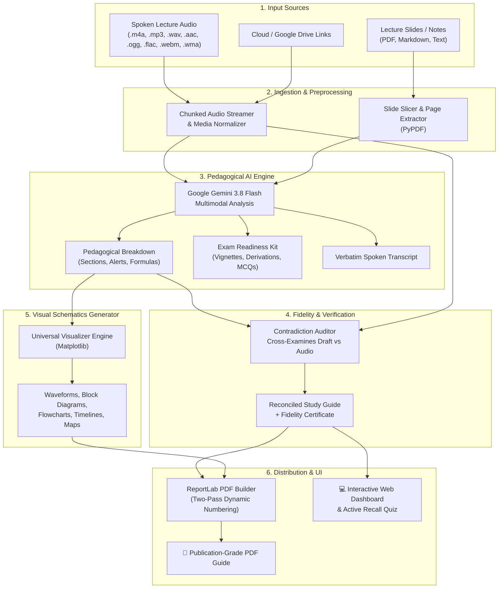

# 🎓 LectureAI — Academic Study Suite

<div align="center">

[](https://www.python.org/)
[](https://fastapi.tiangolo.com)
[](https://aistudio.google.com/)
[](LICENSE)
[]()

**Transform spoken university lectures and slide decks into publication-quality academic study guides, automated engineering schematics, practice exam kits, and audio-audited PDFs.**

[Sample Output](samples/demo_guide.pdf) • [Key Capabilities](#-key-capabilities) • [System Architecture](#-system-architecture) • [Quick Start](#-quick-start) • [CLI Usage](#-cli-usage) • [Interactive Web UI](#-interactive-web-ui) • [License](#-license)

</div>

---

## 💡 What is LectureAI?

University lectures in Engineering, Medicine, Science, and STEM often move fast. Spoken explanations frequently deviate from slides, professors drop verbal hints about exams, and technical terminology is mixed across dialects (such as English and spoken Arabic code-switching).

**LectureAI** is an intelligent, multimodal academic companion. Feed it lecture audio and optional slide decks:

1. **Listens & Translates**: Transcribes spoken audio, handles multilingual dialect code-switching, and synthesizes academic English notes.
2. **Grounds in Slides**: Matches spoken topics to slide decks, extracts precise formulas, and excludes unmentioned slide material.
3. **Fact-Checks & Reconciles**: Cross-examines generated notes against the spoken recording to eliminate hallucinations and embeds an official **Audio & Slides Fidelity Certificate**.
4. **Draws Visual Schematics**: Automatically generates publication-grade block diagrams, circuit waveforms, flowcharts, timelines, and concept maps.
5. **Compiles Publication PDFs**: Builds print-ready PDFs with two-pass page numbering (`Page X of Y`), typographic math, and verbatim transcript appendices.

> 📄 **Sample Output**: Inspect [samples/demo_guide.pdf](samples/demo_guide.pdf) to view a pre-compiled sample study guide produced in simulated demo mode (simulated demo with no real audio processed).

---

## 🌟 Key Capabilities

### 🎙️ 1. Unified Lecture Sources Intake
- **Audio Formats**: `.m4a`, `.mp3`, `.wav`, `.aac`, `.ogg`, `.flac`, `.webm`, `.wma` (local uploads supported up to 2 GB per file via chunked streaming).
- **Notes / Slides Formats**: `.pdf`, `.txt`, `.md`.
- **Direct Cloud & Google Drive Streaming**: Paste public or shareable Google Drive links or direct URLs.
- **Multi-Part Lectures**: Handles multiple consecutive recordings (Part 1, Part 2) and merges them chronologically into one unified narrative.
- **Slide Range Bounds**: Target specific slides per deck (e.g. `Slides 5–28`). If left blank, LectureAI inspects the full deck and includes only concepts verbally taught.

#### 🔀 Unified Mixed-Source Intake
One lecture can seamlessly combine recordings and slide notes from different sources simultaneously in a single intake queue:
1. **Computer Files**: Local file picker or drag-and-drop directly onto intake dropzones.
2. **Drive / Direct Links**: Paste public Google Drive links or direct media URLs.
3. **Course Folders**: Browse and select files from scanned local or Google Drive-synced course folders without locking manual uploads.

**Example Scenario**:
- **Recordings List**:
  - `Part 1 (Computer)`: `Lecture_Part1.m4a` (uploaded from local computer)
  - `Part 2 (Link)`: `https://drive.google.com/file/d/1.../view` (downloaded from Google Drive)
- **Notes / Slides List**:
  - `Deck 1 (Course Folder)`: `Bioinstrumentation_Ch1.pdf` (Slides 1–25)
  - `Deck 2 (Computer)`: `Bioinstrumentation_Ch2_Supplements.pdf` (Slides 26–50)

Items are ordered chronologically with up/down controls (`▲`/`▼`) and individual removal controls (`✕`). Multi-part audio is stitched in sequence, and slide decks are bounded by per-deck slide ranges.

### 🌐 2. Bilingual Speech & Dialect Code-Switching
- Seamlessly transcribes bilingual college lectures (e.g., Egyptian / Levantine Arabic mixed with English engineering terms).
- Synthesizes clean, formal academic English summaries and study guides with zero tofu boxes (`□`) or mixed-language clutter in the final document.

### 📊 3. Zero-Collision Universal Diagram Generator
Generates high-resolution vector diagrams via Matplotlib with collision-free layouts:
- **Electronic Waveforms & Circuit Responses**: Half-wave/full-wave rectifiers, Zener clippers, Shockley oscillators, and harmonic plots.
- **System Block Diagrams**: Subsystems, controller feedback loops, sensor chains, and interface buses.
- **Process Cycles & State Machines**: Iterative loops, feedback cycles, and biological or algorithmic sequences.
- **Scientific Flowcharts**: Decision trees, diagnostic algorithms, and procedural pipelines.
- **Comparison Bar Charts**: Benchmark metrics, computational latencies, and material properties.
- **Timelines & Historical Milestones**: Chronological developments and legal or scientific progressions.
- **Hierarchical Concept Maps**: Taxonomy trees and structural categorizations.

### 📐 4. Typographic Math & Auto-Healing Engine
- Advanced regex healer repairs corrupted mathematical tokens (such as `\Delta rac` &rarr; `\frac`, missing square roots, unrendered subscripts).
- Converts formulas into clear, beautifully formatted mathematical typography without missing-glyph defects.

### 🛡️ 5. Audio & Slides Contradiction Auditor
- Every generated guide is automatically cross-examined against the original spoken audio and slides.
- Contradictions, misheard numbers, or slide discrepancies are caught and reconciled before PDF compilation.
- Embeds a timestamped **Audio & Slides Fidelity Certificate** (audit summary + list of corrections) directly in the PDF.

### ⚠️ 6. "Doctor's Spoken Exam Traps" & Exam Kit
- **Doctor Alerts**: Highlights verbal warnings, grading pitfalls, and "this will be on the final" hints in prominent amber callout boxes.
- **Active Recall Exam Kit**: Generates clinical vignettes, engineering derivations, and conceptual questions modeled on university exams.
- **Interactive Quiz Mode**: Practice one question at a time in the web dashboard, test your knowledge, reveal model answers, and track your recall score.

### 🧬 7. Pre-Configured STEM & Biomedical Focus
- Preloaded with Biomedical Engineering & College STEM courses:
  - *Bioinstrumentation & Biosensors*
  - *Biomedical Signal Processing*
  - *Biomechanics & Biomaterials*
  - *Medical Imaging Systems*
  - *Human Anatomy & Physiology for Engineers*
  - *Medical Device Design & Electrical Safety*
- Add any custom course with 1 click; saved permanently in your browser via `localStorage`.

---

## 🏗️ System Architecture



---

## 🚀 Quick Start

### Prerequisites
- **Python 3.10+** ([Download from python.org](https://www.python.org/downloads/))
- A free **Google Gemini API Key** ([Get your key at Google AI Studio](https://aistudio.google.com/apikey))

---

### Method A: Standard Setup (Windows, macOS, Linux)

1. **Clone the repository:**
   ```bash
   git clone https://github.com/AbdelrhmanElhamy2/lecture-ai-study-suite.git
   cd lecture-ai-study-suite
   ```

2. **Create and activate a virtual environment (recommended):**
   ```bash
   # Windows
   python -m venv venv
   .\venv\Scripts\activate

   # macOS / Linux
   python3 -m venv venv
   source venv/bin/activate
   ```

3. **Install dependencies:**
   ```bash
   pip install -r requirements.txt
   ```

4. **Set your Gemini API key:**
   ```bash
   # Copy the sample environment file
   cp .env.example .env
   ```
   Open `.env` in any text editor and paste your key:
   ```ini
   GEMINI_API_KEY=your_gemini_api_key_here
   GEMINI_MODEL=gemini-3.8-flash
   ```
   *(Alternatively, you can leave it blank and paste it directly into the web interface when launching).*

5. **Run the application:**
   ```bash
   # Option 1: Desktop launcher (starts the server in the background and opens the app window)
   python launcher.py

   # Option 2: Run the FastAPI web server directly
   python app.py
   ```
   Open your browser at: 👉 **http://127.0.0.1:8000**

---

### Method B: 1-Click Setup (Windows)

1. Double-click **`Install_Dependencies.bat`** to automatically check Python and install all packages.
2. Double-click **`Launch_LectureAI.bat`** to start the app.
3. In the web dashboard that opens, click **"Configure Key"** at top right and paste your Gemini API key.

---

## 💻 CLI Usage

LectureAI includes a feature-rich terminal CLI for automated or headless environments:

```bash
# 1. Instant zero-cost simulation (tests models, diagrams, and PDF compilation without API key)
python cli.py --demo

# 2. Process a lecture audio file
python cli.py --audio "path/to/lecture.m4a" --mode exam   # modes: detailed | revision | exam

# 3. Process lecture audio with accompanying slides (slides 1 to 20)
python cli.py --audio "lecture.m4a" --notes "slides.pdf" --start-slide 1 --end-slide 20

# 4. Process multi-part audio recordings (e.g. split into two halves)
python cli.py --audio "part1.m4a" "part2.m4a" --notes "deck.pdf" --output "Lecture_01_Guide.pdf"

# 5. Process directly from Google Drive share links
python cli.py --course "Power Electronics" --audio "https://drive.google.com/file/d/1.../view"

# 6. Run standalone Audio & Slides Contradiction Auditor
python verify_audio_fidelity.py --audio "lecture.m4a" --notes "slides.pdf" --guide "cached_last_guide.json"
```

### 📂 Optional: Course Folder & Google Drive Integration

If you keep your semester materials in a folder (e.g. synced with Google Drive for Desktop), LectureAI can find lecture recordings/slides by session name and save finished PDFs back into each course's `lectures/summaries/` folder.

Set the folder in `.env`:
```ini
LECTUREAI_COURSES_DIR=G:\My Drive\fall 2026
```
Then:
```bash
python cli.py --list-courses
python cli.py --folder "Power Electronics" --session "Lecture 1"
```
Expected layout: `<courses dir>/<Course>/record (<Course>)/lectures/` for audio and `<courses dir>/<Course>/lectures/` for slides.

---

## 🧪 Running Automated Tests

Run the full automated unit test suite to verify models, diagram rendering, slide slicing, math healing, and PDF generation:

```bash
python -m unittest tests/test_suite.py -v
```

The comprehensive automated test suite runs locally and verifies:
- ✅ Pydantic schema validation & serialization
- ✅ Visualizer diagram generation (Flowcharts, Cycles, Bar charts)
- ✅ ReportLab PDF compilation and page numbering
- ✅ End-to-end pipeline simulation
- ✅ Contradiction detection & fidelity audit certificate
- ✅ PDF slide deck slicing and range bounding
- ✅ Math defect auto-healing & history deletion API
- ✅ Selective course material discovery
- ✅ Physics waveform plotting and collision-free layout
- ✅ Tofu box glyph prevention & clean unicode rendering
- ✅ System block diagram integrity & node label preservation
- ✅ History deletion lifecycle & file unlinking
- ✅ Demo endpoint lifecycle & simulated audit badging
- ✅ Unified mixed-source intake & per-deck slide range bounding
- ✅ Corrupt and encrypted PDF error handling
- ✅ Single source of truth configuration & API key privacy

---

## 🔒 Security & Privacy

- **Your API key stays local**: It is read from `.env` (excluded via `.gitignore`) and is never committed.
- **What leaves your machine**: Lecture audio and slides are uploaded to the **Google Gemini API** for transcription and analysis (subject to [Google's Gemini API terms](https://ai.google.dev/gemini-api/terms)). Demo mode (`--demo`) sends nothing.
- **What stays local**: Uploaded files (`uploads/`), generated PDFs (`output_pdfs/`), diagrams (`generated_assets/`), and history (`lecture_history.json`, `cached_last_guide.json`) are stored only on your device — unless you enable the optional Google Drive folder sync.
- **Privacy in History**: Past lecture history records sanitized item counts and categories; raw download URLs, authentication tokens, and local file paths are not stored in history.

---

## 🔧 Troubleshooting

- **File Picker Behavior**: If your browser's native file picker dialog is slow or unresponsive, drag-and-drop works directly onto the "Recordings" and "Notes / Slides" dropzones.
- **Recommended Browser**: For optimal UI responsiveness and local streaming, launch with `python app.py` and open **http://127.0.0.1:8000** in **Google Chrome** or **Microsoft Edge**.
- **Upload Streaming & Size Limits**: Local uploads up to 2 GB are streamed to disk in 1 MB chunks without buffering entire multi-gigabyte recordings into system memory. If an upload fails, staged temporary files are automatically cleaned up.

---

## 📁 Repository Structure

```
lecture-ai-study-suite/
├── app.py                     # FastAPI web application & REST API
├── launcher.py                # Desktop application launcher
├── cli.py                     # Command-line interface
├── pipeline.py                # End-to-end processing pipeline
├── pedagogy_engine.py         # Gemini multimodal analysis & auditor
├── pdf_builder.py             # ReportLab PDF compiler & math healer
├── visualizer.py              # Matplotlib visual schematics generator
├── models.py                  # Pydantic data schemas
├── link_downloader.py         # Google Drive & cloud file downloader
├── mock_generator.py          # Demo simulation guide generator
├── config.py                  # Environment & directory configuration
├── verify_audio_fidelity.py   # Standalone audio/slides contradiction auditor
├── create_desktop_shortcut.py # Creates a Windows desktop shortcut
├── create_icon.py             # Builds the multi-resolution app icon
├── test_*.py                  # Standalone demo/render scripts (not unit tests)
├── requirements.txt           # Python package dependencies
├── .env.example               # Template environment configuration
├── .gitignore                 # Excludes .env, recordings, and outputs
├── pytest.ini                 # Limits pytest to the tests/ folder
├── LICENSE                    # MIT Open Source License
├── AUDIT_REPORT.md            # Security, privacy, and quality audit report
├── LECTUREAI_FULL_DOCUMENTATION.md  # In-depth architecture & development log
├── Install_Dependencies.bat   # 1-click installer for Windows
├── Launch_LectureAI.bat       # 1-click launcher for Windows
├── samples/
│   └── demo_guide.pdf         # Sample pre-compiled study guide (demo mode)
├── templates/
│   └── index.html             # Interactive web UI dashboard
├── static/                    # Icons and application branding
├── tests/
│   └── test_suite.py          # Automated unit test suite
├── uploads/                   # Local staging directory (.gitkeep)
├── output_pdfs/               # Generated study guides (.gitkeep)
└── generated_assets/          # Rendered diagram images (.gitkeep)
```

---

## 📄 License

This project is licensed under the [MIT License](LICENSE) — see the LICENSE file for details.
